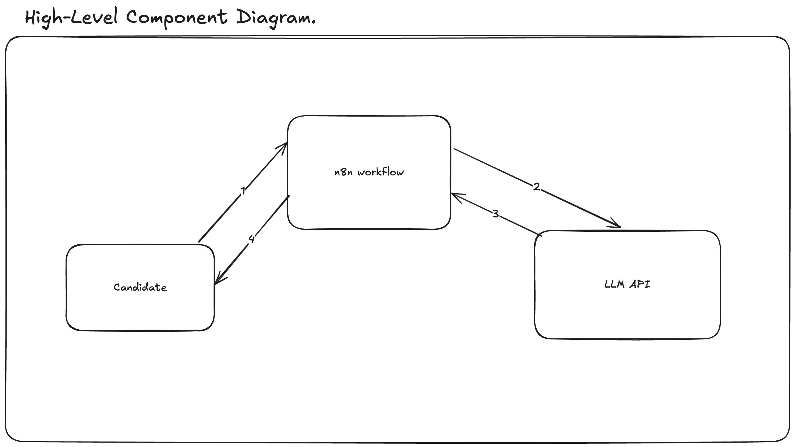
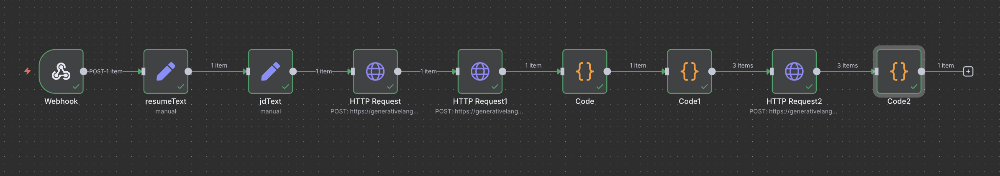

# ElevateCV: AI-Powered Resume Optimization Agent


**ElevateCV** is an advanced, multi-stage AI agent designed to automate the process of tailoring a candidate's resume to a specific job description. By leveraging a modular, first-principles approach, this agent deconstructs the complex task of resume customization into a series of discrete, auditable steps. The result is a highly effective, ATS-compliant document that significantly improves a candidate's visibility and alignment with their target role.

This repository contains the complete architectural plans, workflow logic, and implementation details for the ElevateCV agent.

---

## Table of Contents

1.  [Core Philosophy](#core-philosophy)
2.  [System Architecture](#system-architecture)
    - [High-Level Component Diagram](#high-level-component-diagram)
    - [Detailed Sequence Diagram](#detailed-sequence-diagram)
3.  [Workflow Implementation](#workflow-implementation)
    - [Tooling](#tooling)
    - [Detailed Workflow Plan](#detailed-workflow-plan)
    - [Live Workflow Canvas](#live-workflow-canvas)
4.  [How It Works](#how-it-works)
    - [Stage 1: Ingestion & Validation](#stage-1-ingestion--validation)
    - [Stage 2: Structured Data Extraction](#stage-2-structured-data-extraction)
    - [Stage 3: Iterative Content Re-synthesis](#stage-3-iterative-content-re-synthesis)
    - [Stage 4: Aggregation & Formatting](#stage-4-aggregation--formatting)
5.  [Project Artifacts](#project-artifacts)
6.  [Setup & Deployment](#setup--deployment)

---

## Core Philosophy

The development of ElevateCV was guided by a strict adherence to **first-principles thinking**. Instead of treating resume optimization as a single, monolithic task to be solved by one large prompt, the problem was deconstructed into its fundamental components:

1.  **Information Extraction:** The ability to reliably parse unstructured text from a resume and a job description into a structured, machine-readable format (JSON).
2.  **Semantic Analysis:** The process of identifying the key skills, experiences, and keywords required by the employer.
3.  **Content Re-synthesis:** The targeted rewriting of a candidate's experience to align with the employer's needs while preserving the original meaning and achievements.
4.  **ATS-Compliant Formatting:** The final assembly of the optimized content into a clean, text-based format that can be easily parsed by Applicant Tracking Systems.

This modular approach ensures that each stage of the process is specialized, auditable, and robust, minimizing the risk of errors and hallucinations common in single-shot AI systems.

---

## System Architecture

The agent's architecture was designed and visualized in Excalidraw before implementation to ensure a logical and scalable structure.

### High-Level Component Diagram

The system comprises three primary components: the **Candidate** (end-user), the **n8n Workflow** (orchestration engine), and the **LLM API** (intelligence layer). The n8n workflow acts as the central nervous system, managing the flow of data and coordinating tasks between the user and the AI model.




### Detailed Sequence Diagram

This diagram illustrates the precise interactions and data flow between the components over time. It details the validation checks, the multi-call LLM strategy, and the final assembly process, providing a clear, step-by-step view of the agent's operation.


---

## Workflow Implementation

### Tooling

- **Orchestration:** **n8n (Community Edition)** was chosen as the workflow automation platform. Deployed via Docker, it provided an unlimited, risk-free environment for building and iterating on the agent's logic. Its visual, node-based interface was ideal for implementing the modular design derived from our first-principles analysis.
- **Intelligence:** **Large Language Model API** (e.g., Gemini, OpenAI GPT series) serves as the core intelligence for parsing and rewriting text.
- **Planning:** **Excalidraw** was used for all architectural diagramming and workflow planning.

### Detailed Workflow Plan

This flowchart served as the final blueprint for the n8n implementation. It breaks down the entire process from the initial Webhook trigger to the final response, including the critical looping logic for rewriting bullet points.


### Live Workflow Canvas

The following is a screenshot of the final, implemented workflow in the n8n canvas. Each node represents a specific task outlined in the workflow plan, demonstrating the direct translation of design to execution.



---

## How It Works

The agent executes in four distinct stages:

### Stage 1: Ingestion & Validation

- A **Webhook** node receives the raw text of the candidate's resume and the target job description.
- Initial validation checks ensure that both inputs are present before proceeding.

### Stage 2: Structured Data Extraction

- **LLM Call 1:** The job description text is sent to the LLM with a specialized prompt to extract key skills, technologies, and responsibilities into a structured JSON object.
- **LLM Call 2:** The resume text is sent to the LLM with a different prompt to parse the candidate's contact information, work experience, skills, and education into a structured JSON object.

### Stage 3: Iterative Content Re-synthesis

- A **Loop Over Items** node iterates through each bullet point within the work experience section of the parsed resume.
- **LLM Call 3 (inside the loop):** For each individual bullet point, a highly-targeted request is sent to the LLM. This request provides the context of the job description's keywords and asks the model to rewrite the bullet to be more impactful and aligned with the role. This one-bullet-at-a-time approach ensures high-quality, context-aware rewriting.

### Stage 4: Aggregation & Formatting

- An **Aggregate** node collects all the rewritten bullet points from the loop.
- A final **Code** node assembles the complete, optimized resume. It combines the original structured data (contact info, skills, education) with the newly rewritten experience section, formatting everything into a clean, ATS-friendly text output.
- The final text is sent back as the response to the initial Webhook call.

---

## Project Artifacts

This repository contains the following key files:

| File                   | Description                                                                        |
| ---------------------- | ---------------------------------------------------------------------------------- |
| `approach.pdf`         | A document outlining the initial strategy and first-principles thinking.           |
| `finalplan.excalidraw` | The source file for the architectural diagrams created in Excalidraw.              |
| `My workflow.json`     | The complete, exportable n8n workflow containing all nodes, settings, and prompts. |
| `*.png` / `*.jpg`      | Image files of the diagrams and workflow canvas used in this README.               |
| `README.md`            | This detailed documentation file.                                                  |

---

## Setup & Deployment

To deploy this agent, you will need a running instance of n8n and an API key for a supported Large Language Model.

1.  **Set up n8n:** Deploy n8n using Docker or sign up for a cloud instance.
2.  **Import Workflow:** Import the `My workflow.json` file into your n8n instance.
3.  **Configure Credentials:** Create a new credential for your chosen LLM (e.g., Gemini, OpenAI) and link it to the HTTP Request nodes within the workflow.
4.  **Activate Workflow:** Activate the workflow to enable the Webhook trigger.
5.  **Send Requests:** Send a POST request to the provided Webhook URL with a JSON body containing the resume and job description text.

**Example Request Body:**

```json
{
  "resume_text": "...",
  "jd_text": "..."
}
```
